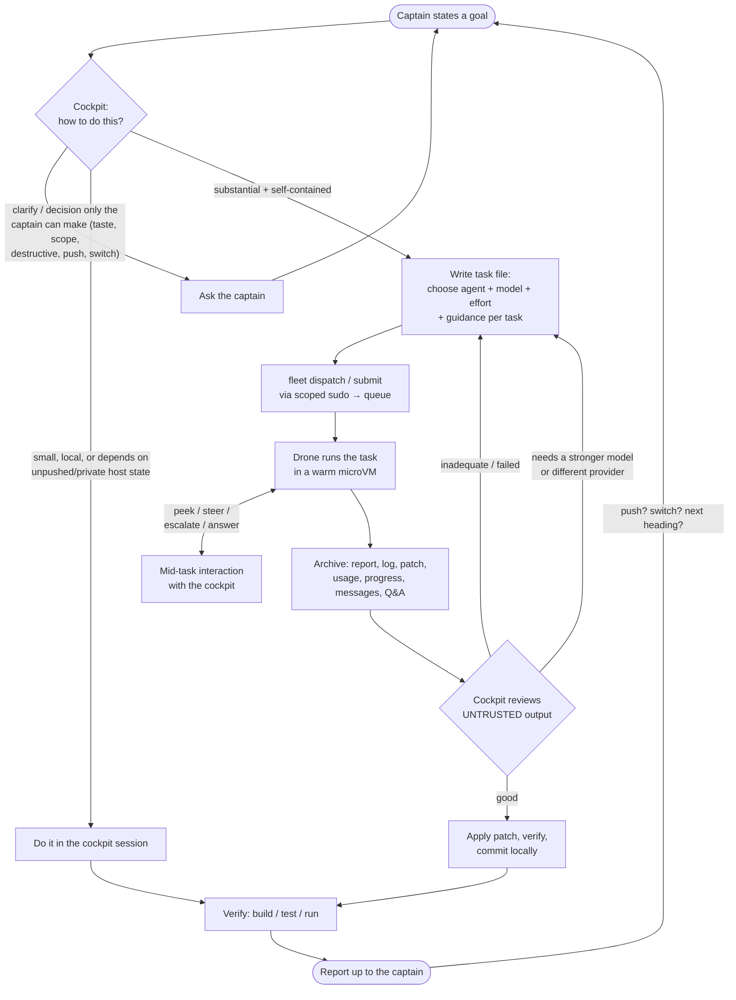
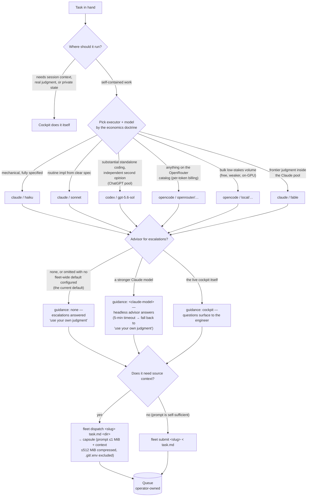
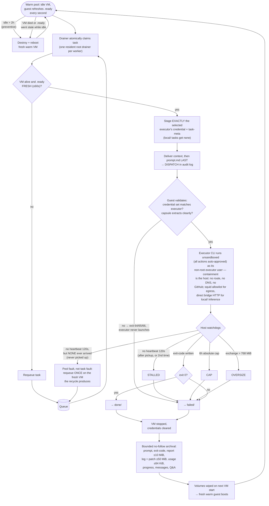
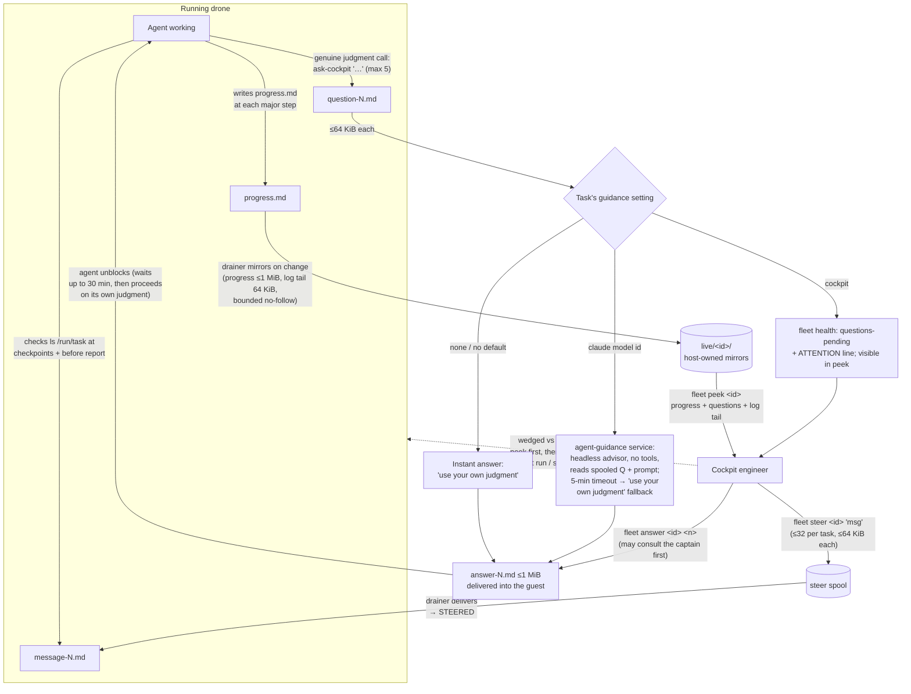
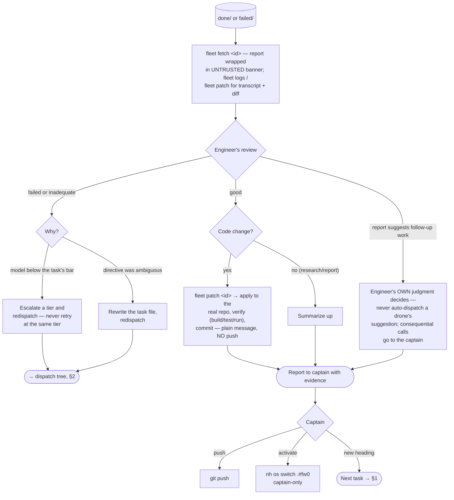

# The life of a task — fleet decision tree

How work moves through the ship: every box a task can visit, every decision
that routes it, and every way it can come back. Companion to
[agent-fleet.md](agent-fleet.md) (mechanics and trust boundaries); this
document is the map.

Roles: the **captain** (human) commands; the **cockpit** (engineer model —
Claude Code seat or opencode web seat, same authority) runs the ship; the
**drones** (disposable worker microVMs) each execute exactly one task.

## 1. The big picture



Authority flows one way — captain → cockpit → drones — and every upward
arrow is *information*, never command: drone output is untrusted data, and
the cockpit acts on it only with its own judgment.

## 2. Dispatch: the cockpit's routing decisions

The cockpit is the sole decider. A task file **must** name `agent` and
`model` (missing either → rejected at submit, exit 2, nothing enqueued —
no downstream defaults exist).



Fan-out is free: submit N tasks and up to 10 warm drones run them
concurrently; the same review can be sent to two vendors in parallel for
genuinely independent opinions.

## 3. Inside the drone: one task, one VM, one life



The VM is destroyed after every task regardless of outcome — a compromised
or wedged drone is one recycle from pristine, and nothing an agent writes
survives except the bounded archive. A drainer that restarts mid-task
(host switch, crash) requeues whatever was stranded in `running/`.

## 4. Mid-task: every way the cockpit and a running drone interact



Two invariants hold everywhere in this diagram: the host **displays**
guest-written content and **delivers** cockpit-written files, but never
takes instructions from guest prose — the only guest bytes the host acts
on are the two narrow machine fields it defined itself (`exit-code` for
done/failed routing, `usage.json` for the cost ledger), both bounded and
format-checked. And everything that crosses the boundary is a bounded
regular file moved with no-follow semantics.

## 5. Results: from archive to the captain



## 6. The full audit trail

Every **state-changing** hop leaves a line in `/var/lib/agents/tasks/log`
(read-only commands — watch, fetch, logs, patch, peek — do not):

```
SUBMIT → DISPATCH → [STEER → STEERED]*
                  → [ESCALATE (→ ANSWER → ANSWERED, cockpit guidance only)]*
                  → DONE | TIMEOUT (after a STALLED / CAP / OVERSIZE line)
```

A pre-pickup stall instead logs a requeue and later a second `DISPATCH`.
Model-advisor escalations log only `ESCALATE` — the guidance service
answers without further log lines. Add `NOTE` for free-text cockpit
annotations and rejection lines for anything that failed a trust check.
`fleet status` tails the log; `ship-status` shows the live pool;
`ship-costs` attributes each task's tokens to its subscription pool.
